# Лабораторна робота №3: Реалізація веб-інтерфейсу на основі шаблону MVC

- **Варіант:** 15
- **Тема:** Discord

## Завдання:
На основі шаблону МVС створіть веб-додаток, який за запитом користувача візуалізуватиме дані з предметної області описаної в Лабораторній роботі №1 (згідно отриманого варіанту).
- Визначте, що буде основною сутністю вашої предметної області (наприклад, для інтернет-магазину - це товар).
- Реалізуйте Контролер(и), з відповідними методами дії, які можуть відображати інформацію про сутність вашої предметної області.
- Створіть Модель, що описує логіку даних вашої предметної області. Модель взаємодіє із базою даних, яка наповнюється відповідними тестовими даними.
- Потрібно реалізувати можливість додавати, редагувати та видаляти дані.
- Вибірка даних із Моделі відображається за допомогою Представлення і подається у вигляді HTML-сторінки.
- Вичитка даних відбувається з використанням класів рівня бізнес-логіки.

---

### Реалізовані ключові вимоги:
* **Основна сутність:** `Server` (з вкладеними залежностями `Channel`, `Member` та `Message`).
* **Контролер:** Реалізований через маршрути Flask у `web_controller.py`, що обробляє `GET` та `POST` запити.
* **Модель:** ORM-моделі на базі SQLAlchemy, які взаємодіють із базою даних SQLite через рівень бізнес-логіки (BLL).
* **CRUD операції:** Повна підтримка створення, читання, оновлення та видалення (Create, Read, Update, Delete) для серверів, каналів, учасників та повідомлень.
* **Представлення (View):** Динамічні HTML-сторінки, створені за допомогою шаблонізатора Jinja2 та кастомних стилів у стилі Discord.

---

## Архітектура системи
Проєкт використовує принципи **Clean Architecture** для розширення стандартного MVC:

* **Model (Domain & DAL):**
    * `src/domain/models.py`: Визначає структуру даних та зв'язки.
    * `src/data_access/`: Репозиторії для низькорівневих запитів до БД.
* **Controller (BLL & Web):**
    * `src/business_logic/services.py`: Містить «мозок» додатка, виконує валідацію та координацію процесів.
    * `src/presentation/web_controller.py`: Пов'язує HTTP-маршрути з методами сервісів.
* **View (Templates & Static):**
    * `src/presentation/templates/`: Файли Jinja2 (`index.html`, `messages.html` тощо).
    * `src/presentation/static/`: Модульні CSS-файли (`chat_new.css`, `channels.css`).

---

## Структура проєкту

```text
Discord/
├── data/                  # База даних SQLite та CSV-файли для початкового заповнення
├── screenshots/           # Демонстрація інтерфейсу та роботи системи
├── src/
│   ├── app.py             # Composition Root: Ініціалізує BLL/DAL та запускає сервер Flask
│   ├── business_logic/    # BLL: Сервіси (DataImportService), що містять логіку
│   ├── data_access/       # DAL: Репозиторії, конфігурація БД та інтерфейси
│   ├── domain/            # Моделі: ORM-сутності SQLAlchemy (User, Server, Role тощо)
│   ├── presentation/      # PL (Компоненти MVC)
│   │   ├── static/        # Ресурси: кастомні CSS стилі в стилі Discord
│   │   ├── templates/     # Представлення: HTML-шаблони Jinja2
│   │   └── web_controller.py # Контролер: Визначає маршрути Flask та обробляє запити
│   └── main.py            # Точка входу для CLI-операцій або вторинної логіки
├── check_db.py            # Утиліта для аудиту цілісності бази даних
├── generator.py           # CLI-інструмент для генерації масивів тестових даних (1000+ рядків)
├── requirements.txt       # Залежності проєкту (Flask, SQLAlchemy, Faker)
└── .gitignore             # Налаштування ігнорування venv, кешу та файлів БД
```

---

## Як запустити

### 1. Підготовка середовища
```bash
python -m venv venv
# Активуйте venv: (Windows: venv\Scripts\activate | Linux: source venv/bin/activate)
pip install -r requirements.txt
```

### 2. Запуск веб-додатку
```bash
python -m src.app
```
*Сервер буде доступний за адресою `http://127.0.0.1:5000/`.*

### 3. Верифікація бази даних

```bash
python check_db.py

```

*Виводить статистику записів у кожній таблиці для перевірки цілісності.*

---

## Демонстрація роботи

Наведені нижче скріншоти демонструють реалізацію UI та взаємодію в межах MVC:

### І. Ініціалізація та Інфраструктура

Цей етап демонструє запуск системи та зв'язок між шарами BLL та DAL.

  * **Ініціалізація додатка**
    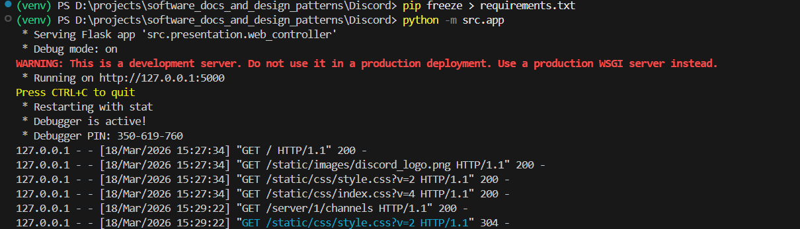  
    *Лог терміналу: запуск Bootstrapper-а, ініціалізація сесій SQLAlchemy та підняття Flask-сервера.*
  * **Головна панель (Dashboard)**   
    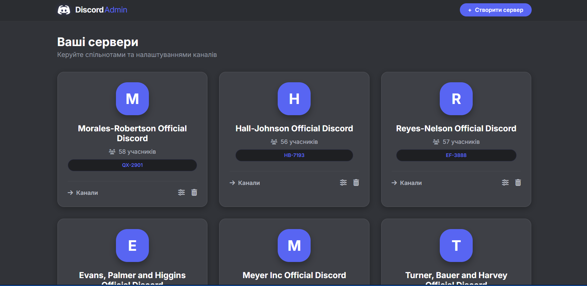
    *Перегляд усіх сутностей `Server`. Реалізація паттерну **View** (Jinja2), що відображає дані, отримані через сервіси BLL.*

### ІІ. Керування Серверами (Server CRUD)

Демонстрація повного життєвого циклу основної сутності системи.

  * **Створення сервера (Create)**   
    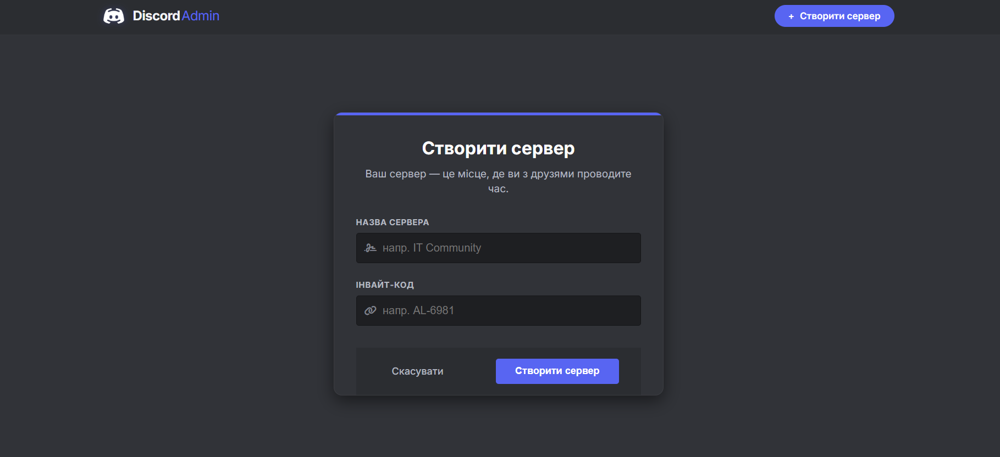
    *Обробка `POST`-запиту: валідація унікальності `invite_code` та збереження у базі через DAL.*
  * **Редагування сервера (Update)**   
    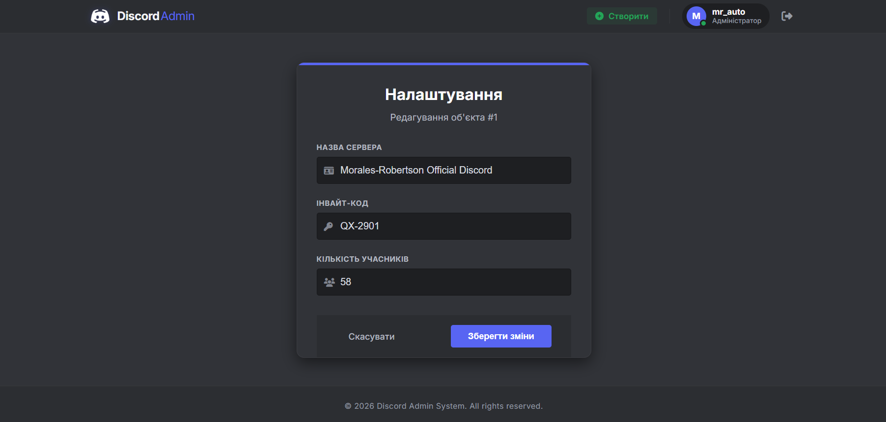
    *Оновлення метаданих сервера. Демонстрація передачі даних у форму через `GET` та оновлення через `POST`.*
  * **Видалення сервера (Delete)**   
    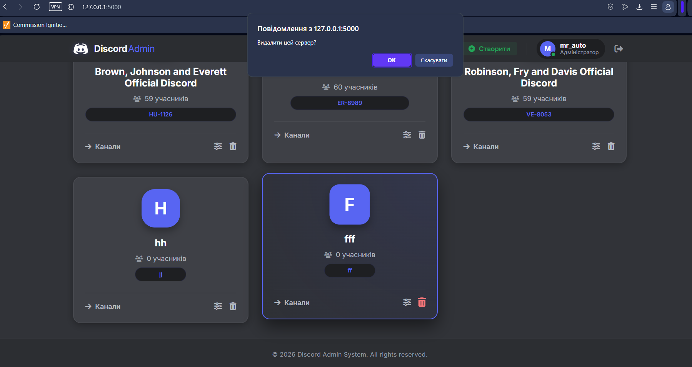
    *Видалення запису з БД. Реалізовано каскадне видалення (Cascade Delete) усіх пов'язаних каналів та повідомлень.*

### ІІІ. Канали та Комунікація (Communication Layer)

Робота з вкладеними сутностями та бізнес-логікою чату.

  * **Список каналів сервера**   
    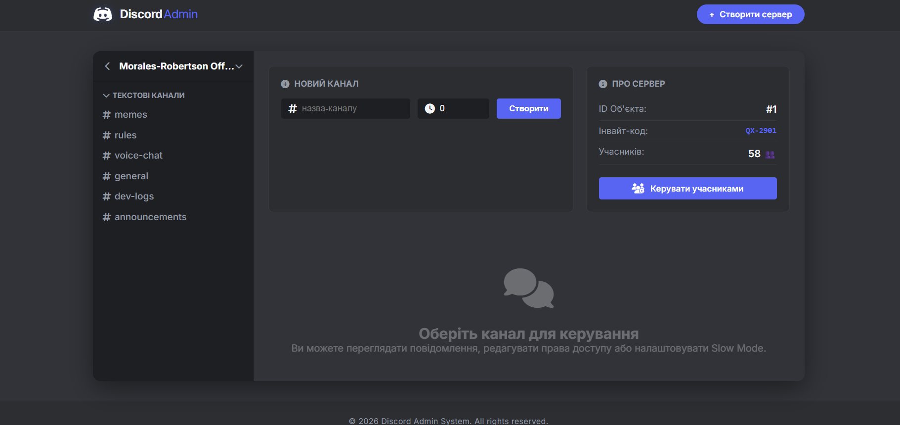
    *Візуалізація зв'язку `1:N` між Сервером та Каналами.*
  * **Створення та видалення каналів** 
    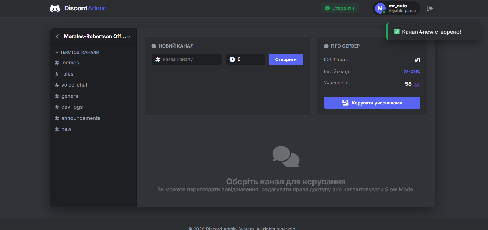  
    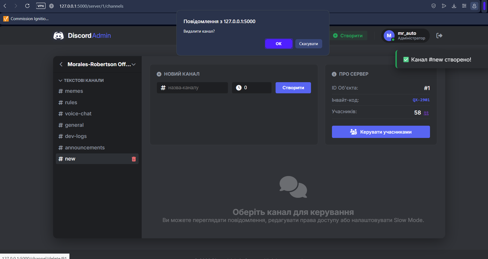 
    *Швидкі операції керування структурою сервера.*
  * **Стрічка повідомлень (Chat View)**   
    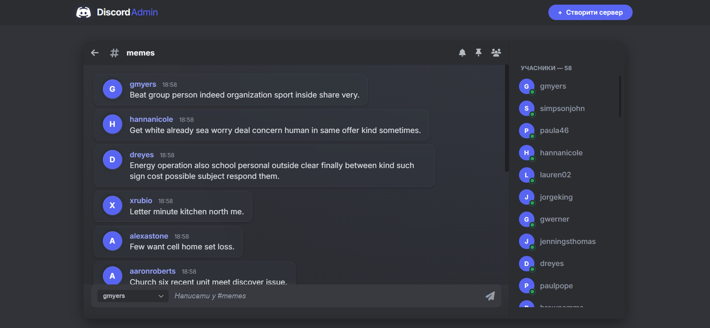
    *Візуалізація сутності `Message`. Реалізовано динамічний мапінг авторів та форматування дати/часу.*

### IV. Керування учасниками (IAM — Identity & Access Management)

Демонстрація логіки авторизації та керування правами доступу.

  * **Панель учасників**   
    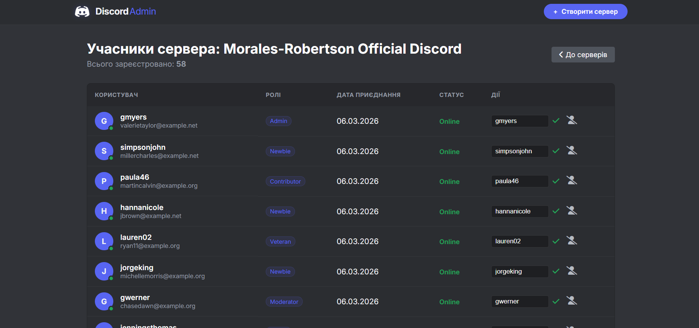
    *Відображення зв'язку `N:M` (користувачі та ролі) через проміжну таблицю `Member`.*
  * **Додавання та редагування учасників**    
    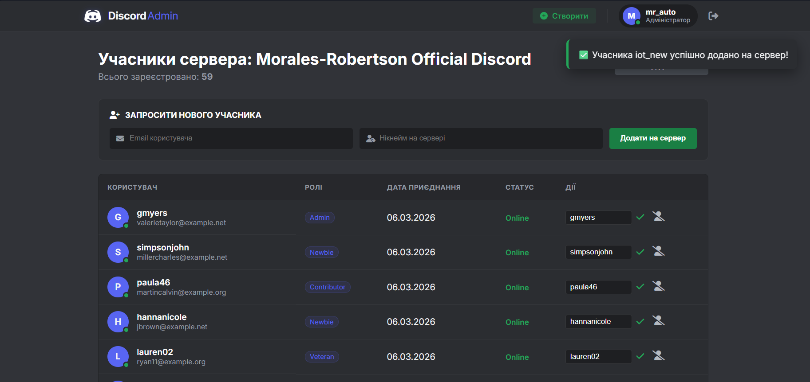
    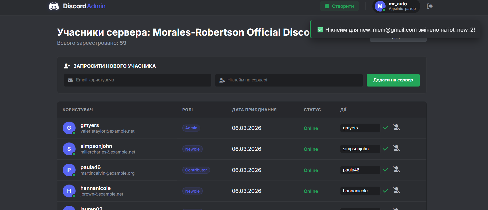
    *Логіка призначення нікнеймів та перевірка на існуючі `User` профілі за Email.*
  * **Видалення учасника (Kick)**   
    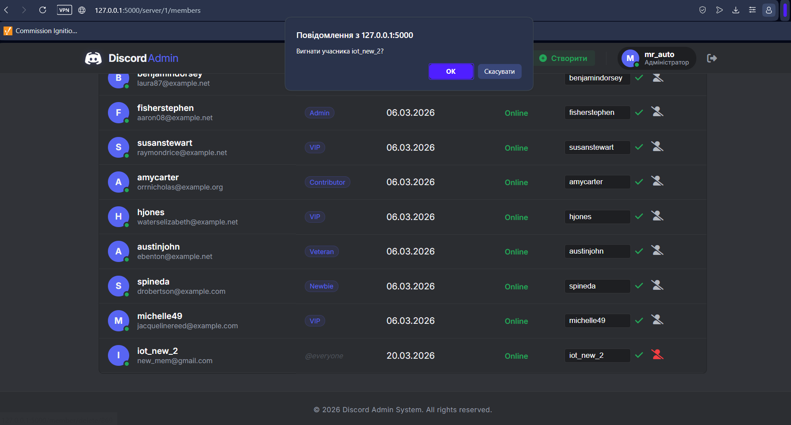
    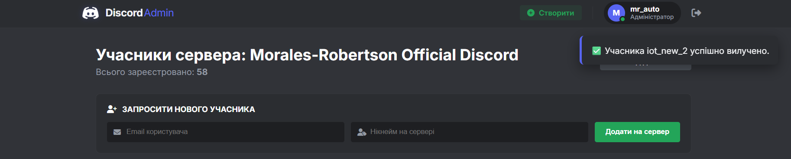
    *Видалення зв'язку учасника з сервером без видалення глобального профілю користувача.*

---

## Технічні особливості
* **Joined Table Inheritance:** Використано для сутностей `ServerOwner` та `TextChannel`.
* **Мапінг зв'язків:** Реалізовано One-to-Many (`Server` -> `Channels`) та Many-to-Many (`Member` <-> `Role`).
* **Адаптивний UI:** Верстка на базі Flexbox/Grid, що імітує десктопний клієнт Discord.
* **Чистий код:** Децентралізована логіка дозволяє легко змінити SQLite на PostgreSQL або Flask на FastAPI з мінімальними правками.

---

## *️⃣ Додаткове завдання: Система авторизації та автентифікації *️⃣

В межах захисту роботи було реалізовано повноцінну систему керування доступом (IAM), інтегровану в існуючу Clean Architecture:

### Реалізований функціонал:

  * **Реєстрація користувачів (Sign Up):** Створення нового об'єкта `User` через BLL з перевіркою унікальності Email.
  * **Безпечне зберігання паролів:** Використано бібліотеку `werkzeug.security` для хешування паролів (PBKDF2-SHA256). Паролі в чистому вигляді в БД не зберігаються.
  * **Керування сесіями:** Використано `flask.session` для збереження стану авторизації між запитами.
  * **Захист маршрутів (Middleware):** Реалізовано кастомний декоратор `@login_required`, який обмежує доступ до адмін-панелі для неавторизованих гостей.
  * **Динамічний інтерфейс:** Хедер додатка адаптується під стан користувача (відображення аватара, імені та кнопки Logout).

### Демонстрація системи безпеки

### 1\. Сторінка реєстрації (Sign Up)
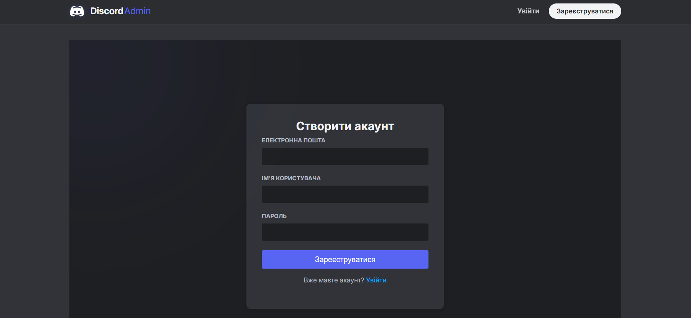
*Користувач може створити новий акаунт. Пароль автоматично хешується перед збереженням у базу даних.*

### 2\. Сторінка входу (Login)
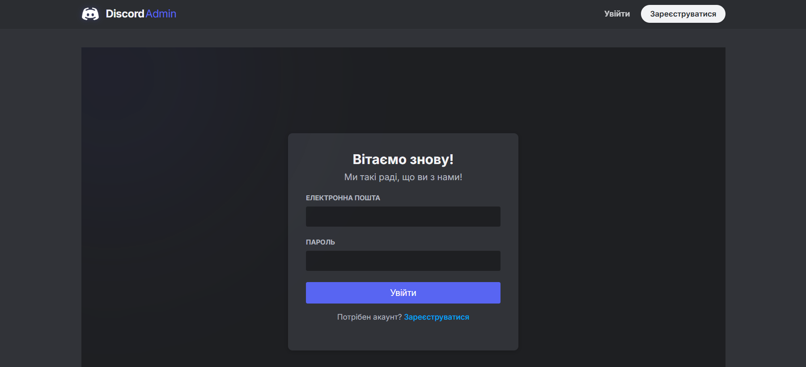
*Фірмова сторінка входу в стилі Discord. Система перевіряє введені дані через Business Logic Layer.*

### 3\. Валідація даних та помилки

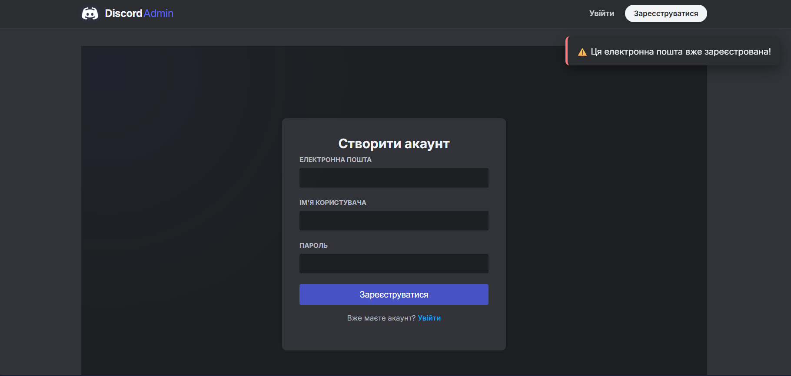
*Демонстрація обробки помилок: повідомлення про невірний пароль чи відсутність користувача або спробу реєстрації на вже зайняту пошту (Flash messages).*

### 4\. Успішна авторизація (Session Active)
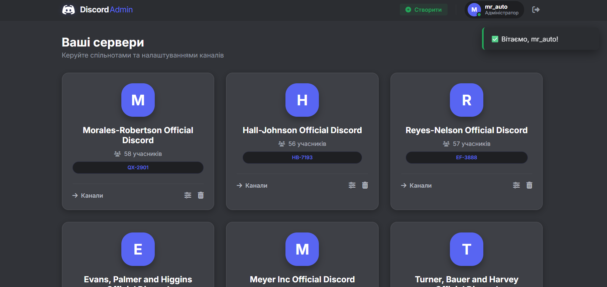
*Стан після входу: у хедері з'являється персоналізований "User Pill" з аватаркою, ім'ям користувача та статусом Online.*

### 5\. Захист маршрутів (Access Control)
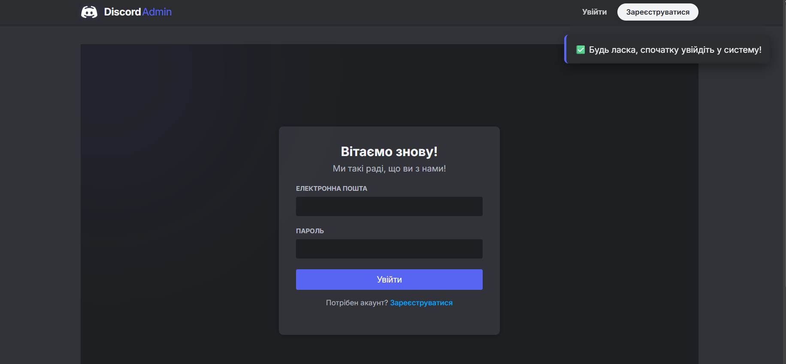
*Демонстрація роботи декоратора `@login_required`: при спробі перейти за прямим посиланням на список серверів без логіна, система автоматично перенаправляє на сторінку входу.*