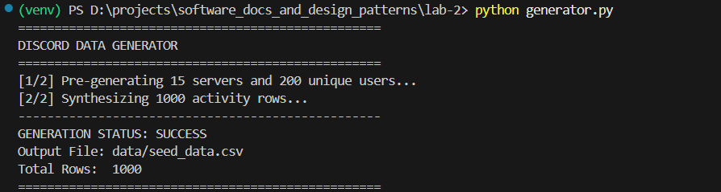
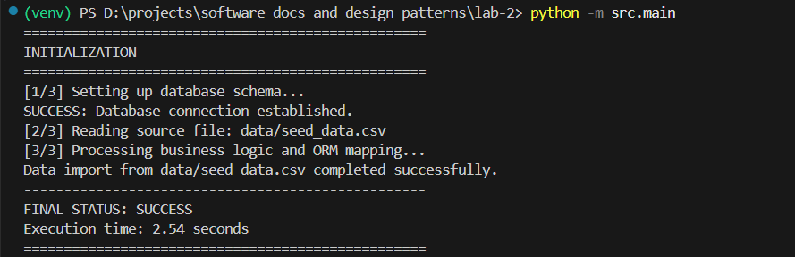
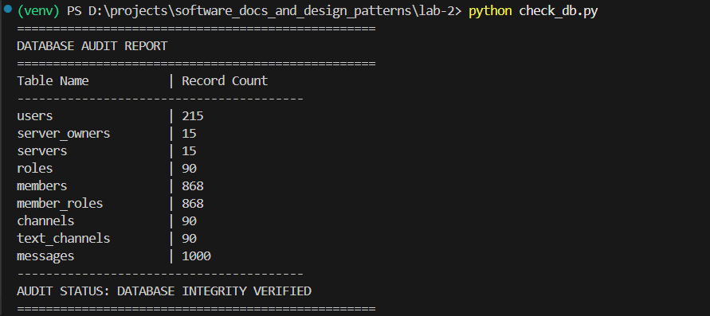
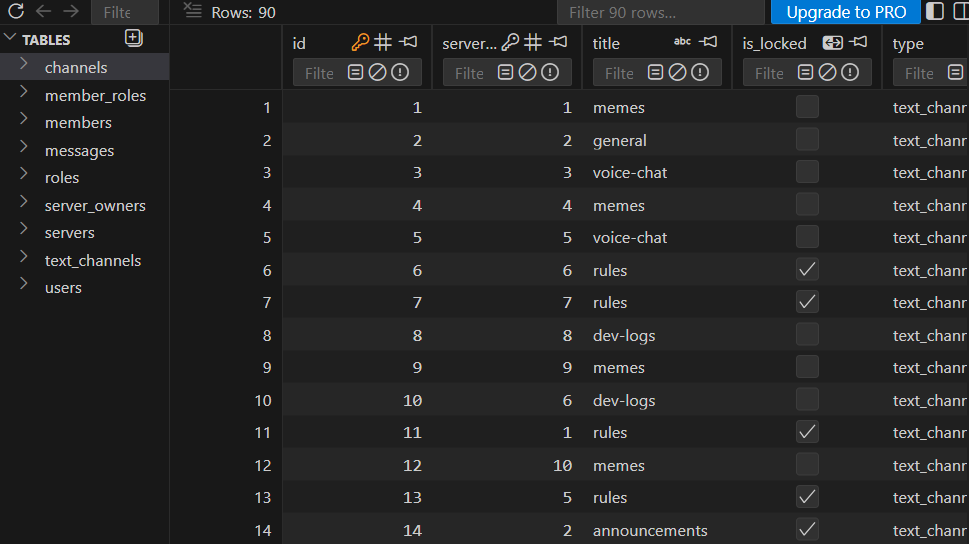

# Лабораторна робота №2: Реалізація серверної частини аплікації

- **Варіант:** 15
- **Тема:** Discord

## Завдання:
- Реалізуйте серверну частину аплікації, котра складається з трьох рівнів:
  - Рівень доступу до даних
  -	Рівень бізнес логіки
  -	Презентаційний рівень
- Зв'язок між рівнями слід реалізувати із застосуванням інтерфейсів (класи рівня бізнес-логіки мають використовувати інтерфейси рівня доступу до даних, а не імплементацію) та шаблонів інверсія управління та впровадження залежностей
- Презентаційний рівень на даний момент не виконує жодної логіки і представлений лише інтерфейсами
- Рівень доступу до даних слід реалізувати з використанням ORM фреймворку для заповнення бази даних, створеної в лабораторній 1(діаграма класів). Також на рівні доступу до даних слід реалізувати зчитування даних з .csv файлу.
- Рівень бізнес-логіки здійснює виклик рівня доступу до даних для вичитування даних з файлу, виконує створення необхідних моделей для заповнення бази даних та викликає рівень доступу до даних для збереження інформації в базі даних.

**Важливо:** 
- всі дані мають міститись в одному файлі. 
- При завантаженні даних в базу даних слід реалізувати необхідну логіку для коректного збереження даних в таблиці. 
- Файл має містити мінімально 1000 рядків. 
- Для створення файлу слід створити окремий модуль/клас, який запускається з командного рядка.

---

## Архітектура системи
Проєкт побудований на принципах **Clean Architecture**, що забезпечує гнучкість та незалежність шарів:

* **DAL (Data Access Layer)**: Реалізує паттерн Repository. Містить конкретні класи для роботи з SQLAlchemy та логіку парсингу CSV файлів.
* **BLL (Business Logic Layer)**: Містить сервіси (наприклад, `DataImportService`), які координують процес завантаження даних, перевіряють існуючі записи та створюють нові моделі.
* **PL (Presentation Layer)**: Визначає контракти для відображення профілів, списків серверів та історії чатів.
* **Domain**: Описує основні сутності системи (User, Server, Message) та їх відображення (mapping) на таблиці БД через SQLAlchemy.


---

## Структура проєкту

```text
Lab-2/
├── data/                  # База даних SQLite та CSV файли
├── screenshots/           # Скріншоти виконання програми
├── src/
│   ├── business_logic/    # Логіка сервісів та обробки даних
│   ├── data_access/       # Репозиторії, інтерфейси та конфіг БД
│   ├── domain/            # ORM моделі сутностей
│   ├── presentation/      # Інтерфейси презентаційного рівня
│   └── main.py            # Точка входу та ініціалізація (DI Bootstrapper)
├── check_db.py            # Утиліта для аудиту бази даних
├── generator.py           # CLI генератор тестових даних (1000+ рядків)
├── requirements.txt       # Залежності проєкту (SQLAlchemy, Faker)
└── .gitignore             # Налаштування ігнорування venv та БД

```

---

## Реалізація моделей

Моделі в коді повністю відповідають UML-діаграмі. Реалізовано наступні зв'язки:

* **Успадкування (Inheritance)**: Використано Joined Table Inheritance для `ServerOwner` та `TextChannel`.
* **Композиція (Composition)**: Сервер жорстко володіє своїми каналами та ролями (cascade delete).
* **Агрегація (Aggregation)**: Зв'язок між сервером та його учасниками (Members).
* **Багато-до-багатьох (Many-to-Many)**: Призначення ролей учасникам через асоціативну таблицю `member_roles`.

---

## Як запустити

### 1. Підготовка середовища

```bash
python -m venv venv
# Активуйте середовище (Windows: venv\Scripts\activate)
pip install -r requirements.txt

```

### 2. Генерація даних (1000+ рядків)

```bash
python generator.py

```

*Створює файл `data/seed_data.csv` з унікальними серверами, користувачами та повідомленнями.*

### 3. Запуск імпорту та бізнес-логіки

```bash
python -m src.main

```

*Ініціалізує базу даних, створює 10+ таблиць та мігрує дані з CSV.*

### 4. Верифікація бази даних

```bash
python check_db.py

```

*Виводить статистику записів у кожній таблиці для перевірки цілісності.*

---

## Демонстрація роботи

Нижче наведено результати виконання програми:

### 1. Робота CLI Генератора


*Процес успішного створення 1000 рядків для 15 серверів та 200 користувачів.*

### 2. Виконання імпорту (Main)


*Лог роботи BLL: відображення кроків ініціалізації та мапінгу об'єктів.*

### 3. Верифікація БД та зв'язків


*Підсумкова таблиця з підрахунком записів у всіх сутностях.*

### 4. Перегляд структури БД


*Візуалізація схеми бази даних та Foreign Keys через SQLite Viewer.*