# Лабораторна робота №4: Реалізація GoF-паттерну "Стратегія"

- **Варіант:** 15 
- **Тема:** New York City Leading Causes of Death Data Analysis & Multi-channel Data Export (Strategy Pattern)

## Завдання:
- Необхідно вичитати дані із отриманого згідно варіанту датасету і записати їх в файл. 
- Потрібно застосувати шаблон проектування стратегія для виводу отриманих даних в різні сховища. 
- Код, який виводить рядки в консоль, має бути відділений від коду, що робить вичитку даних з файлу. -
- Код виводу в консоль має бути організований з використанням паттерну стратегія, і дозволяти переключити вивід з консолі на запис у кафку та Redis з мінімальними змінами в коді (тобто без змін в самому коді, а лише з-за допомогою зміни в конфігураційних файлах).

## Архітектура системи
Проєкт побудований на базі патернів **Strategy** та **Simple Factory**, що дозволяє відокремити бізнес-логіку від інфраструктурних деталей.

### Ключові компоненти:
* **Strategy Interface (`BaseStrategy`):** Абстрактний базовий клас, що визначає контракт для всіх методів експорту (`send`).
* **Concrete Strategies:**
    * `ConsoleStrategy`: Форматований вивід у термінал.
    * `FileStrategy`: Запис JSON-структур у текстовий файл.
    * `KafkaStrategy`: Стрімінг повідомлень у брокер повідомлень (з підтримкою імітації).
    * `RedisStrategy`: Збереження даних у KV-сховище з використанням унікальних хеш-ключів.
    * `FirebaseStrategy`: Експорт у хмарну NoSQL базу даних Google Firebase з попередньою валідацією типів.
* **Context (`DataExporter`):** Клас, який використовує обрану стратегію для обробки потоку даних.
* **Creator (`StrategyFactory`):** Логіка вибору конкретної стратегії на основі конфігурації.
* **Resilience (Graceful Degradation):** Реалізовано механізм автоматичного переходу в режим імітації (Mock) у разі недоступності Docker-інфраструктури (Kafka/Redis).

---

## Структура проєкту

```text
NYC-Data-Analysis/
├── config/
│   └── settings.json       # Конфігурація: вибір стратегії та шлях до датасету
├── data/
│   ├── nyc_deaths.csv      # Вхідний датасет (Нью-Йорк, 2007-2021)
│   └── output.txt          # Результат роботи FileStrategy
├── screenshots/            # Докази роботи (Console, Kafka, Redis, Error Handling)
├── src/
│   ├── core/
│   │   ├── reader.py       # CSVReader: логіка вичитки з підтримкою лімітів
│   │   └── exporter.py     # DataExporter: контекст патерну Strategy
│   ├── interfaces/
│   │   └── base_strategy.py # Абстрактний інтерфейс стратегії
│   ├── strategies/         # Конкретні реалізації стратегій
│   │   ├── console_strategy.py
│   │   ├── file_strategy.py
│   │   ├── kafka_strategy.py
│   │   └── redis_strategy.py
│   ├── factory.py          # Фабрика для створення об'єктів стратегій
│   └── main.py             # Точка входу: ініціалізація та запуск циклу експорту
├── docker-compose.yml      # Інфраструктура: Kafka, Zookeeper, Redis
├── requirements.txt        # Залежності (pandas, kafka-python, redis)
└── README.md               # Документація проєкту
```
---

## Конфігурація (`config/settings.json`)

Система підтримує динамічне налаштування без необхідності перекомпіляції або зміни коду. Усі ключові параметри винесені у файл `settings.json`:

```json
{
    "strategy": "kafka",
    "data_path": "data/nyc_deaths.csv",
    "kafka_topic": "nyc_deaths",
    "redis_key": "death_record"
}
```
### Опис параметрів:
* **`strategy`**: Визначає активний канал експорту (`console`, `file`, `kafka`, `redis`).
* **`data_path`**: Шлях до вхідного CSV-файлу з датасетом.
* **`kafka_topic`**: Назва топіка в Apache Kafka, куди будуть надсилатися повідомлення.
* **`redis_key`**: Базовий префікс для ключів при збереженні в Redis.

---

## Інструкція з розгортання та запуску

Дотримуйтесь цих кроків для коректної роботи системи:

### 1. Підготовка середовища
Переконайтеся, що у вас встановлено **Python 3.10+** та **Docker Desktop**.
Створіть віртуальне середовище та встановіть залежності:
```bash
python -m venv venv
source venv/bin/activate  # для Windows: venv\Scripts\activate
pip install -r requirements.txt
```

### 2. Запуск інфраструктури
Запустіть контейнери з Kafka та Redis через Docker Compose:
```bash
docker-compose up -d
```
*Зачекайте 15-20 секунд, поки Kafka повністю ініціалізується.*

### 3. Запуск програми
Ви можете змінити стратегію прямо в `settings.json` або передати її як аргумент:
```bash
# Запуск зі стратегією за замовчуванням (з конфігу)
python -m src.main

# Примусовий запуск конкретної стратегії
python -m src.main -s kafka
```

### 4. Моніторинг результатів
* **Kafka:** 
```bash
docker exec -it nyc-data-analysis-kafka-1 kafka-console-consumer --bootstrap-server localhost:9092 --topic nyc_deaths --from-beginning
```
* **Redis:** 
```bash
docker exec -it nyc-data-analysis-redis-1 redis-cli 
# (далі команда `KEYS *`).
```
* **File:** Перевірте вміст файлу `data/output.txt`.

---

## Технічні особливості реалізації

1.  **Повна декупляція (Decoupling):** Клас `CSVReader` нічого не знає про те, куди йдуть дані. Він лише генерує потік словників (dictionaries). Це дозволяє змінювати джерело даних (наприклад, на SQL БД) без впливу на стратегії виводу.
2.  **Динамічна ініціалізація (Simple Factory):** Об'єкт конкретної стратегії створюється лише в момент запуску програми на основі рядкового ідентифікатора з конфігурації.
3.  **Механізм відмовостійкості (Graceful Degradation):** Реалізовано логіку **Imitation Mode** (імітація). Якщо програма не може встановити зв'язок з брокером Kafka або базою Redis протягом заданого таймауту, вона замість "падіння" перемикає стратегію в режим логування імітованих дій, що дозволяє тестувати бізнес-логіку навіть без розгорнутої інфраструктури.
4.  **Унікальна ідентифікація даних:** Для Redis реалізовано автоматичну генерацію унікальних ключів на основі хешування (MD5) значень рядка, що запобігає дублюванню та перезапису записів при повторному експорті.
5.  **Робота з ресурсами:** Використання генераторів (`yield`) у `CSVReader` дозволяє обробляти файли великого об'єму (GB+) без надмірного навантаження на оперативну пам'ять.

---

## Демонстрація роботи

Наведені нижче скріншоти демонструють успішну роботу патерну **Strategy** та коректну взаємодію з контейнеризованою інфраструктурою.

### 1\. Робота стратегій експорту (Success Scenarios)

Кожна стратегія була протестована на вибірці з 10 записів для забезпечення наочності виводу.

  * **Console Strategy (Прямий моніторинг):**
    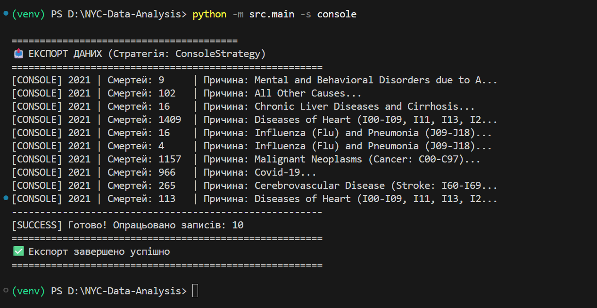
    *Демонстрація форматованого виводу в CLI. Система автоматично вирівнює колонки (Рік, Кількість, Причина) для зручного аналізу потоку даних.*

  * **File Strategy (Локальне збереження):**
    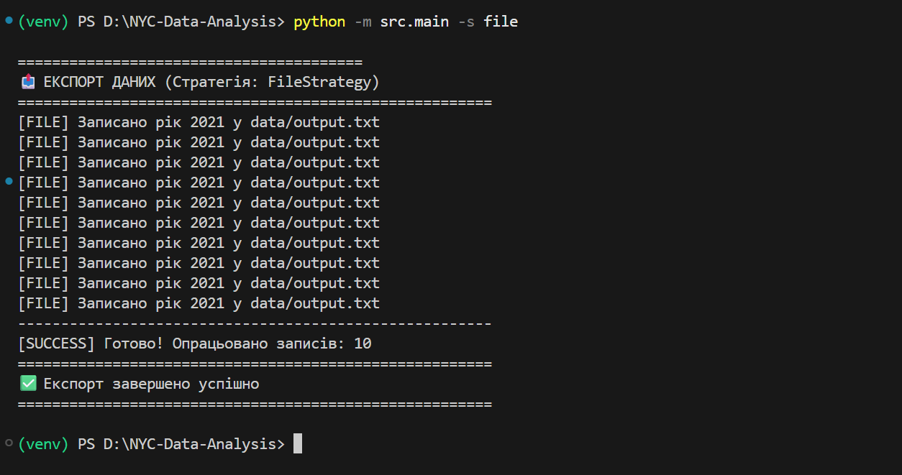
    *Процес серіалізації об'єктів у текстовий формат. Нижче наведено скріншот результуючого файлу `data/output.txt` з накопиченими записами:*
    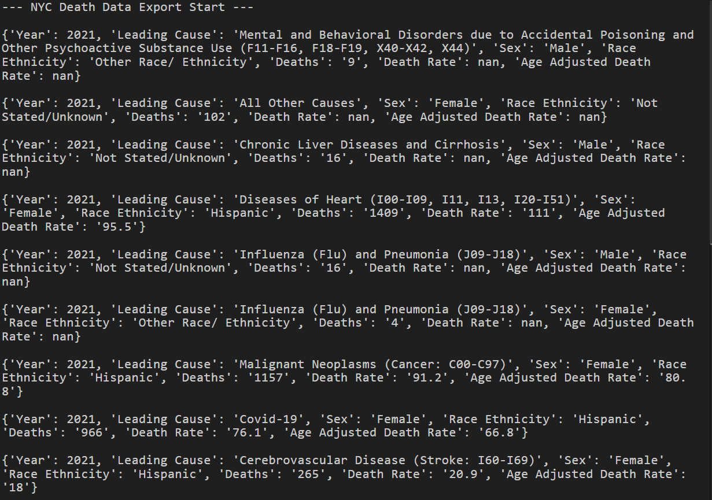

  * **Kafka Strategy (Стрімінг подій):**
    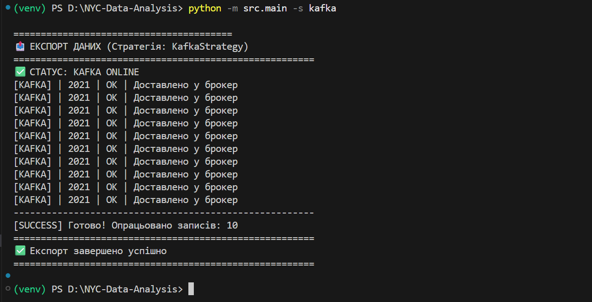
    *Підтвердження успішної передачі повідомлень у брокер. Кожен рядок отримує статус `OK` після підтвердження від Kafka.*

  * **Redis Strategy (KV-кешування):**
    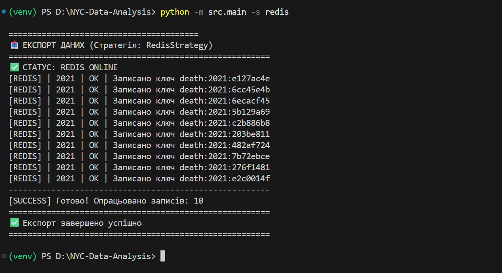
    *Збереження даних із використанням унікальних MD5-хешів як ключів. Це гарантує відсутність дублікатів у базі при повторних запусках.*

### 2\. Стійкість системи (Resilience & Mock Mode)

Однією з ключових особливостей реалізації є механізм **Graceful Degradation**. Якщо Docker-контейнери не запущені, система не "падає", а переходить у режим імітації.

  * **Fallback-логіка для Kafka та Redis:**
    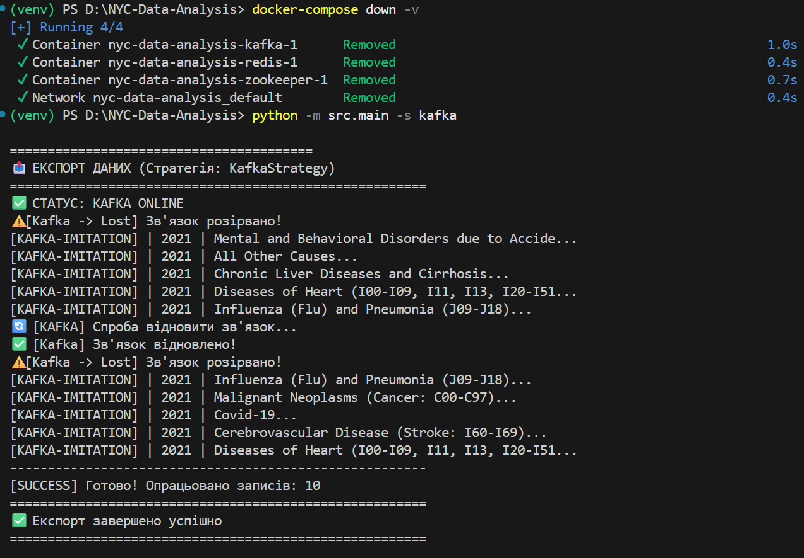
    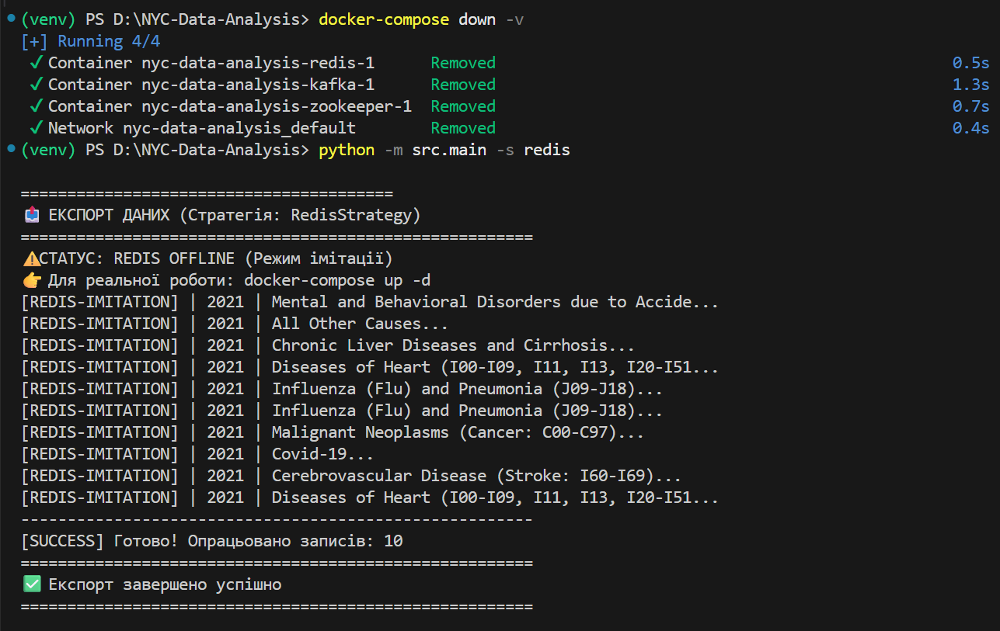
    *Система детектує `ConnectionError`, виводить попередження та продовжує роботу в режимі `[IMITATION]`, логуючи дії, які мали б відбутися в реальних базах.*

### 3\. Верифікація інфраструктури Docker

Зовнішні сервіси розгорнуті в ізольованому оточенні через `docker-compose.yml`.

  * **Ініціалізація сервісів:**
    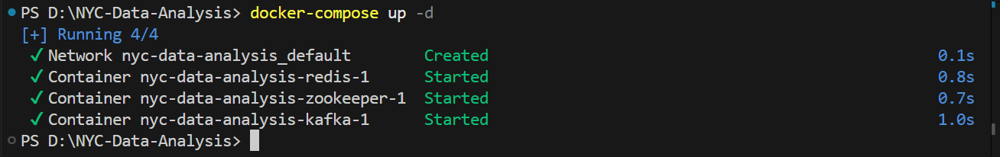
    *Перевірка статусу контейнерів: Kafka, Zookeeper та Redis знаходяться у стані `Up` та готові до прийому з'єднань.*

  * **Аудит даних у Redis CLI:**
    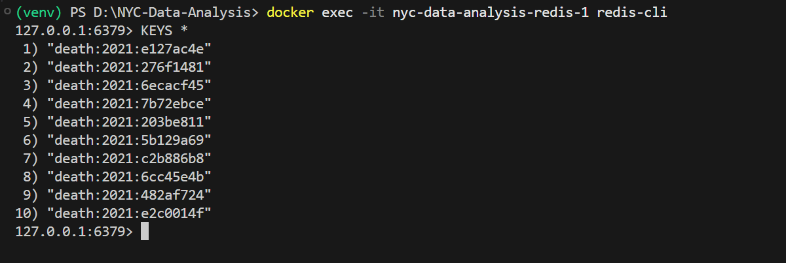
    *Запит `KEYS *` у консолі Redis підтверджує фізичну наявність записів у базі після завершення роботи Python-скрипта.*

  * **Аудит даних у Kafka Consumer:**
    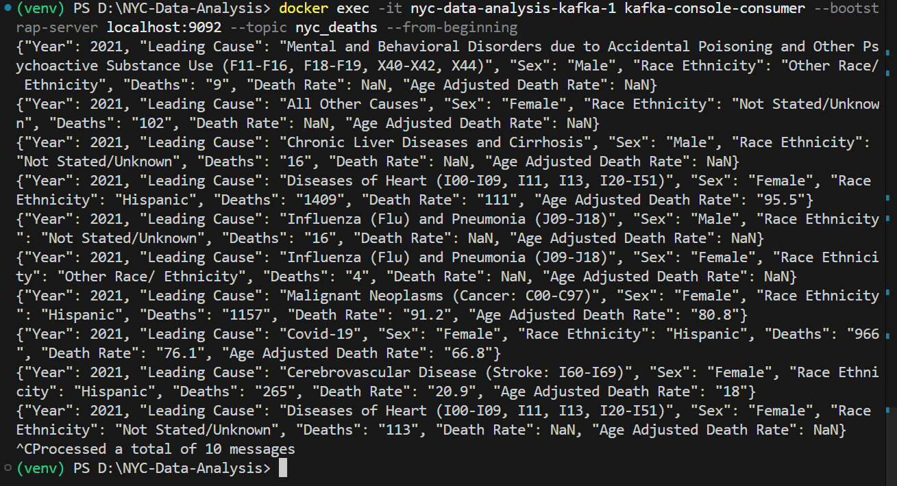
    *Використання `kafka-console-consumer` для перегляду "сирого" JSON-потоку, що надійшов від нашої програми в топік `nyc_deaths`.*


## *️⃣ Додаткове завдання: Інтеграція з Cloud Firebase *️⃣

В межах розширення функціоналу було реалізовано додаткову стратегію для експорту даних у хмарне сховище **Firebase Realtime Database**. Це демонструє справжню силу патерна **Strategy**: додавання нового каналу (Cloud Provider) відбулося без зміни існуючої логіки обробки даних.

### 1\. Реалізація Firebase Strategy
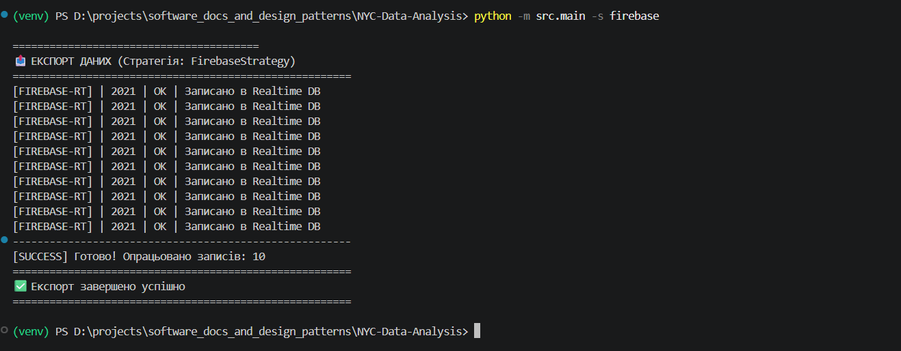
*Процес синхронізації локальних даних із хмарою. Система ініціалізує `firebase-admin` та виконує пакетне завантаження записів у реальному часі.*

### 2\. Валідація та очищення даних (Data Cleaning)

Оскільки Firebase Realtime DB працює суворо з форматом JSON, було реалізовано додатковий шар обробки:

  * **Обробка `NaN` / `Infinity`**: Автоматичне очищення датасету від значень, що не підтримуються JSON-стандартом.
  * **Security Rules**: Налаштування прав доступу на базі сервісного аккаунту (`serviceAccountKey.json`).

### 3\. Верифікація у Firebase Console
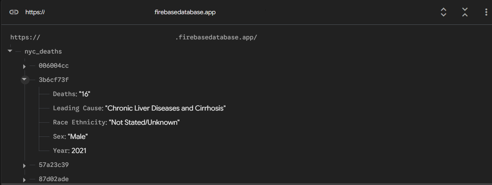
*Перевірка структури даних у хмарній консолі Google. Дані організовані у вигляді дерева з унікальними ключами (MD5-хеш), що забезпечує ідемпотентність записів.*

### 4\. Обробка помилок та Fallback

*Демонстрація стійкості до відсутності мережі або файлів конфігурації. При помилці автентифікації система автоматично перемикається в режим `[FIREBASE-IMITATION]`, запобігаючи зупинці всього пайплайну.*