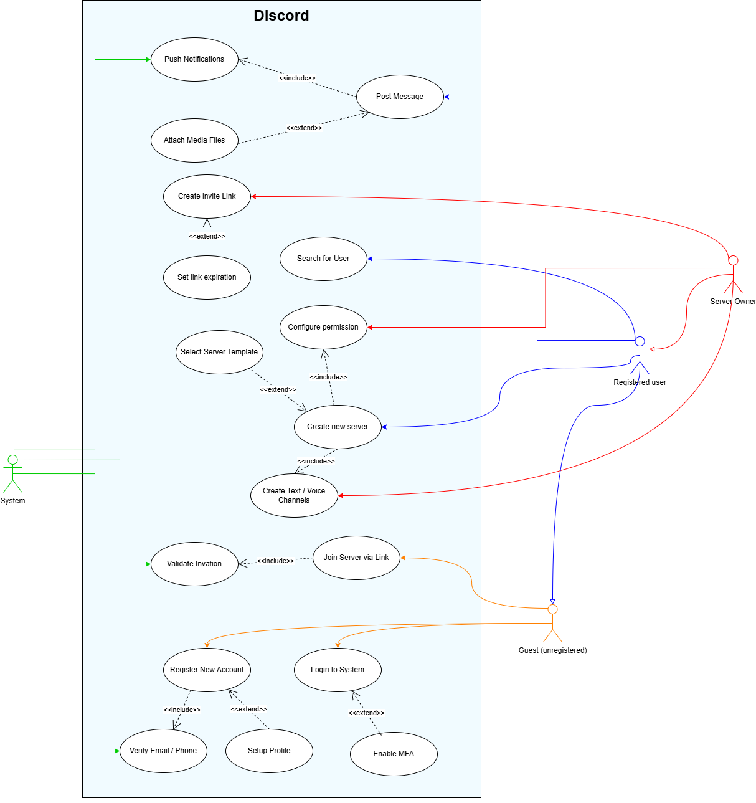
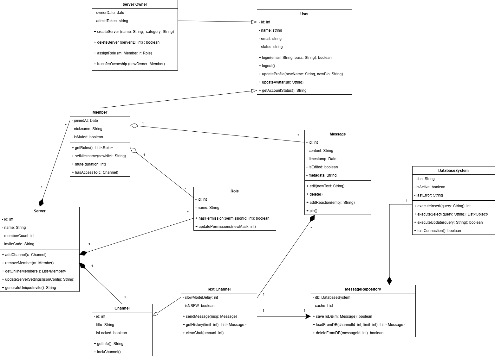
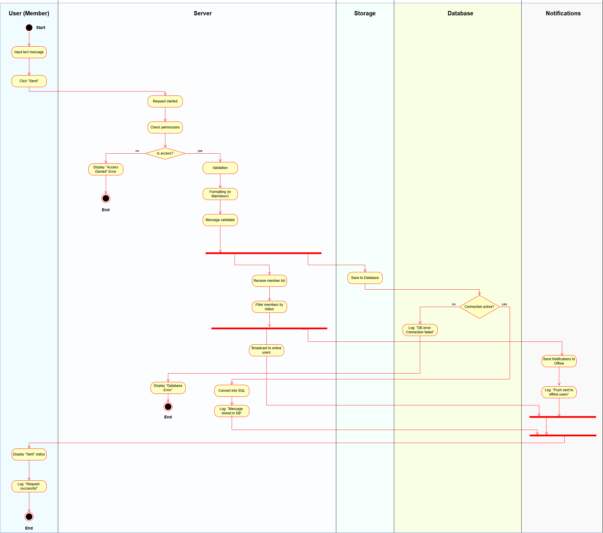
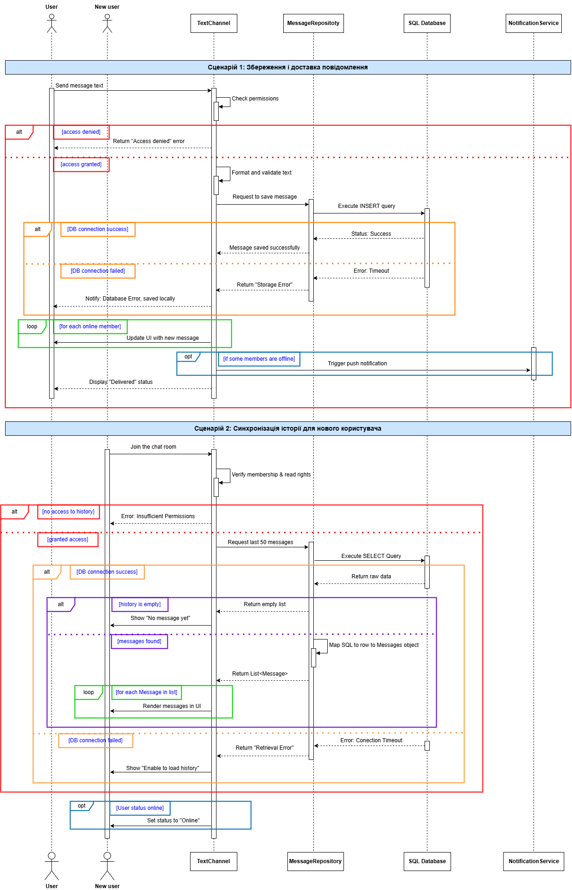

# Лабораторна робота №1: Діаграми архітектури ПЗ

- **Варіант:** 15
- **Тема:** Discord

## Завдання:
1. Намалюйте use-case діаграму створення нового чату та добавляння нових користувачів в ча (з врахування їх реєстрації)
2. Намалюйте діаграму класів, щоб представити множину об’єктів, необхідних для створення чату, обміну повідомлень та їх збереження у базу даних 
3. Намалюйте діаграму активності додавання нового повідомлення в чат, та його доставку для всіх учасникі чату та збереженняісторії чату
4. Намалюйте sequence діаграму, яка показує яким чином зберігаються повідомлення в базі даних та показуються новому користувау при його вході в чат

---

## Діаграми

### 1. Use-Case Діаграма

*Відображає функціональні можливості системи з точки зору різних акторів: **Registered User**, **Server Owner**, **Guest** та **System**. Враховано життєвий цикл користувача — від реєстрації до управління серверами, створення каналів та надсилання повідомлень з Push-сповіщеннями.*

### 2. Діаграма класів

*Описує статичну структуру системи для створення чату, обміну повідомлень та їх збереження у базу даних з використанням поліморфізму і успадкування. Архітектура включає **патерн Repository** для ізоляції бізнес-логіки від прямої взаємодії з `DatabaseSystem`.*

### 3. Діаграма активності

*Демонструє динаміку обробки повідомлення на сервері. Використано **swimlanes** для розділення зон відповідальності між клієнтом, сервером, сховищем та базою даних.*

### 4. Sequence Діаграма

*Деталізує взаємодію об'єктів у часі для двох критичних сценаріїв: **збереження повідомлення** та **синхронізація історії** для нових учасників. Відображено логіку обробки помилок (таймаути БД, відмова в доступі) та вкладену активацію для внутрішніх методів обробки даних.*